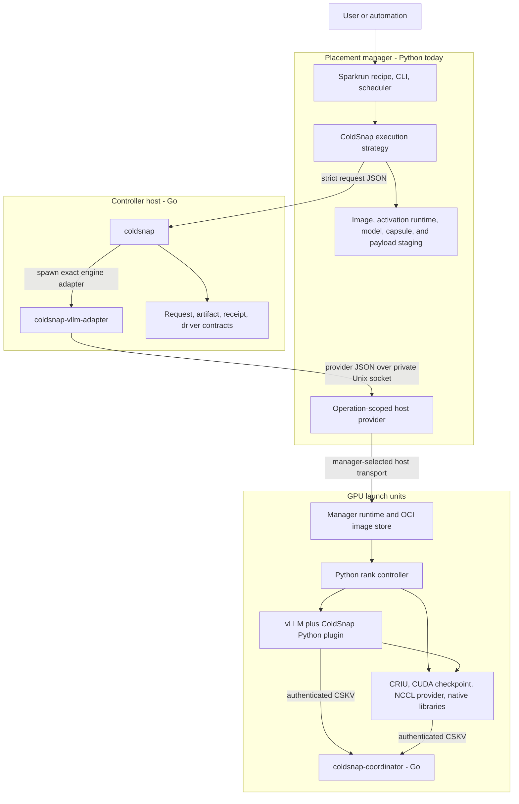
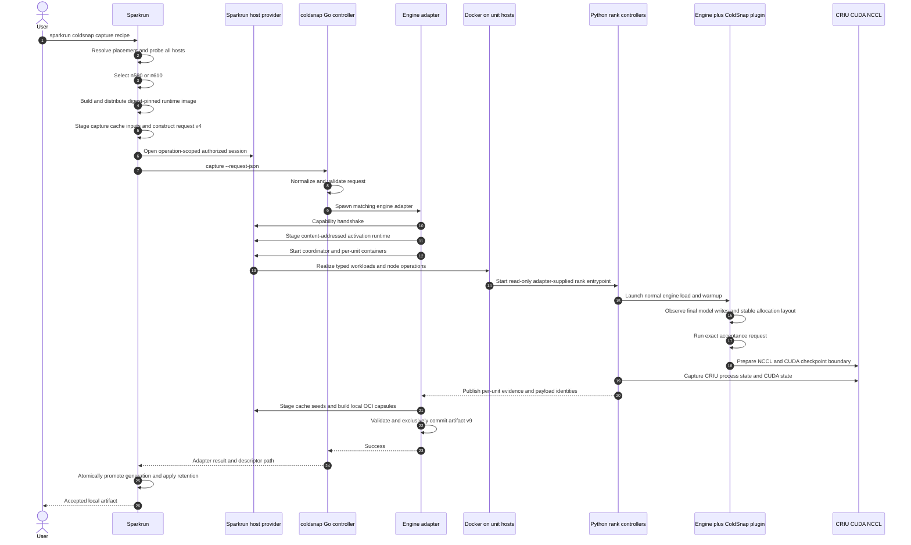
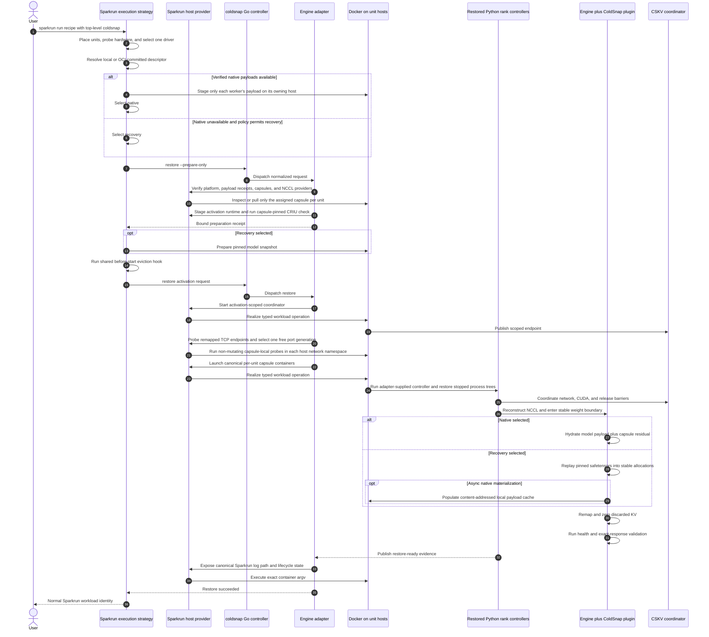
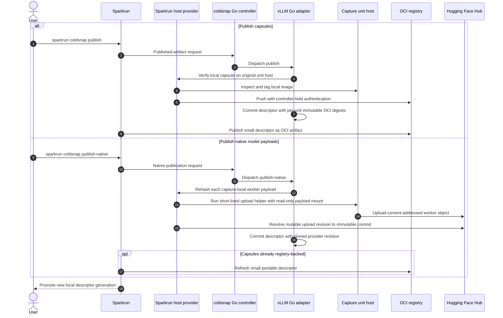
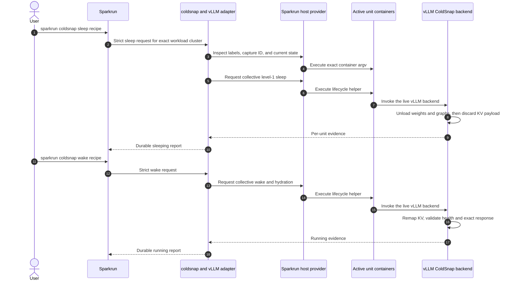

<!--
SPDX-FileCopyrightText: 2026 Scitrera LLC
SPDX-FileCopyrightText: 2026 Fox Engine Ltd
SPDX-License-Identifier: AGPL-3.0-only
-->

# ColdSnap architecture

Status: ColdSnap 0.3.20. The manager realizes typed image/workload requests;
Docker is the reference manager backend, not an engine-adapter dependency.
See [runtime-neutral managers](runtime-neutral-managers.md) for the required
manager capability, compatibility boundary, and remaining qualification work.

## Executive summary

ColdSnap is a layered snapshot system, not a single daemon:

- a placement manager such as Sparkrun owns user intent, scheduling, hardware
  discovery, image/model staging, credentials, replacement ordering, and the
  transport used to reach GPU hosts;
- the Go `coldsnap` controller owns strict operation contracts, receipts, and
  engine dispatch;
- a separate Go engine adapter owns distributed capsule orchestration and
  restore admission for one inference engine;
- Python inside the serving image integrates with engine lifecycle, memory,
  loading, and validation semantics;
- native C/C++ libraries and the CRIU/CUDA/NCCL runtimes perform the low-level
  memory and process work.

vLLM is the broadest qualified end-to-end engine. SGLang also has an active Go
process-snapshot adapter with Qwen TP2 native and recovery support on both
drivers. The n610 default preserves qualified CUDA graph executables while
reconstructing NCCL transport in place. The n580 path restores a context-free
pre-exec template and initializes a fresh engine with pinned safetensors or a
native payload. Graph recreation and speculative-worker behavior are detailed
in [the SGLang integration guide](sglang-plugin.md).

The main portability decision is to separate small, driver-specific process
state from large model bytes. Each launch unit gets a driver-qualified OCI
capsule. Each accelerator worker may reference a content-addressed native model
payload, while the pinned Hugging Face safetensors revision remains the required
recovery provider. A native payload is optional; no ColdSnap blob registry is
required.

## Terms and identity boundaries

| Term | Meaning |
| --- | --- |
| Manager | Placement-aware caller such as Sparkrun or a future Kubernetes operator. |
| Controller | The engine-neutral Go `coldsnap` executable. |
| Engine adapter | A separate Go executable, `coldsnap-vllm-adapter` or `coldsnap-sglang-adapter`, that implements engine-selected distributed operations over shared orchestration. |
| Snapshot process driver | The `n580` or `n610` Go orchestration and driver contract. This is not the runtime coordinator. |
| Rank activation controller | Driver-specific Python that sequences one rank or launch unit through CRIU, CUDA, NCCL, hydration, and readiness. |
| Runtime coordinator | The shared, short-lived Go CSKV service used only for authenticated barriers and small key/value exchange. |
| Activation runtime | The adapter-embedded, content-addressed helper pack staged per host. Its Python files are mounted read-only for capture or restore; its adapter binary also exposes the host-side native-payload verifier. |
| Launch unit | One container or process-tree activation boundary. A unit may own more than one GPU worker. |
| Worker | One accelerator-owning engine process slot inside a launch unit. |
| Group | An ordered, engine-owned rank namespace such as tensor, pipeline, data, expert, or context parallelism. |
| Capsule | One unit's OCI image containing CRIU/CUDA/NCCL state, runtime residuals, and derived-cache seed data. |
| Model payload | Optional content-addressed model bytes, owned by a worker and stored outside the capsule. |
| Residual | Driver/runtime-specific non-model bytes needed to reconstruct the captured stable allocation layout. |
| Recovery provider | The pinned original Hugging Face safetensors plus a replay plan into the captured layout. |
| Snapshot driver | A named process-snapshot implementation (`n580` or `n610`), not merely the installed NVIDIA driver number. |

The current wire/storage versions are request format 4, artifact format 9,
operation receipt format 2, timing-event format 1, manager host-provider format
1, activation-runtime format/ABI 1, coordinator CSKV version 1, and
snapshot-driver ABI 1. `coldsnap capabilities` is the machine-readable source
for public protocol formats, accepted request/artifact formats, driver
contracts, and the presence of content-addressed activation-runtime support;
the adapter logs the exact staged pack digest.

## System shape

There are two distinct control protocols:

1. The manager host-provider protocol carries controller-to-host operations
   over a private local Unix socket. Sparkrun implements the server and
   ColdSnap implements the client. The manager decides how those operations
   reach a node.
2. The CSKV coordinator protocol is a short-lived, authenticated TCP service
   used by restored ranks and the NCCL checkpoint runtime for distributed
   barriers and key/value coordination.

Neither protocol carries bulk model or checkpoint payloads. Bulk data moves
through host files, Docker/OCI, the Hugging Face Hub, or manager staging.

## Ownership by implementation language

### Sparkrun: Python manager and user-facing surface

The first-party Sparkrun plugin is the normal user interface. Its authoritative
sources live under `src/sparkrun/plugins/coldsnap/` in the separate
[sparkrun-coldsnap-plugin repository](https://github.com/sparksq/sparkrun-coldsnap-plugin).
Sparkrun distributions vendor a pinned plugin snapshot, recorded by
`vendor/coldsnap.lock` and packaged `VENDORED.toml` metadata. It owns:

- the top-level `coldsnap:` recipe item and its typed validation;
- `sparkrun coldsnap capture|publish-native|publish|materialize|restore|warm|sleep|wake|status|native-status|delete`;
- selection of the ColdSnap execution strategy for ordinary `sparkrun run`;
- cluster placement, topology construction, hardware probing, and selection of
  the newest snapshot driver supported by every placed host;
- the ColdSnap image builder on top of an exact digest-pinned engine image;
- shared image preparation and distribution;
- per-worker native-payload staging only onto the worker's owning host, full
  first-use verification, cached validation evidence, and safe full-hash
  revalidation when that evidence becomes stale;
- pinned Hugging Face snapshot preparation only when recovery is selected;
- identity-derived descriptor storage, atomic generation promotion, and
  retention of the configured last N generations;
- prepare-before-evict ordering through the reusable execution-strategy hooks;
- canonical Sparkrun container names, labels, log paths, status, and stop
  behavior after restore;
- registry and Hugging Face credential ownership; and
- the operation-scoped host-provider server.

The provider uses Sparkrun's `HostSession` abstraction. That session may use
SSH today, but this is a Sparkrun transport choice rather than an SSH call made
by the ColdSnap adapter. The same provider protocol can sit over a Kubernetes
node API, `exec`, a DaemonSet, or another manager transport.

Sparkrun intentionally omits most policy defaults from a recipe. It sends only
typed overrides and lets the selected ColdSnap driver resolve its own defaults.
It does, however, own communication variables, offline-mode variables, and
placement-specific values because those come from the live cluster plan.

Remote storage policy is cluster-local rather than recipe identity. A cluster
may set `sparkrun_cache_dir`; ColdSnap inherits its `coldsnap` child unless
`plugins.coldsnap.state_root` overrides it. `plugins.coldsnap.io.recovery_read`
can override filesystem-aware recovery `auto` for a qualified site. The
existing cluster `cache_dir` remains the Hugging Face/model cache and is not
overloaded for either purpose.

### Go: contracts and distributed process orchestration

The Go code has several separate responsibilities:

| Component | Current responsibility |
| --- | --- |
| `cmd/coldsnap` and `internal/cli/request.go` | Strict request decoding, operation/engine dispatch, process cancellation, stable receipts, controller timing, and `capabilities`. |
| `internal/snapshot` | Request format 4, artifact format 9, provider selection, topology, capability admission, graph policy, portability, and receipt/timing schemas. |
| `internal/operationtiming` | Context-safe controller and adapter span collection, bounded NDJSON lifecycle emission, and cross-process timing-envelope merge. |
| `internal/snapshotdriver` | Explicit `n580`/`n610` contracts and driver-owned default policy selection. |
| `internal/payloadvalidation` | Canonical native-payload file admission, full SHA-256 validation, stat-bound validation records, stable JSON results, and authenticated local RPC over the same validator used by the CLI. |
| `cmd/coldsnap-vllm-adapter`, `cmd/coldsnap-sglang-adapter`, and `internal/inferenceadapter` | Engine-selected capture, publish, restore preparation, activation-runtime staging, lifecycle control, compatibility checks, capsule construction, and host operations. |
| `runtime/engine/assets.go` | Adapter-embedded activation-runtime pack, ABI, file digests, and read-only container targets. |
| `internal/adaptercli` | Common adapter entrypoint, request/engine validation, required manager-provider connection, timeout, and cancellation boundary. |
| `internal/hostops` | Transport-neutral host-operation interface supplied by a manager. |
| `internal/hostprovider` | Client for the manager's operation-scoped external provider. |
| `internal/capsule` | Local per-unit capsule build and explicit OCI publication. |
| `internal/ncclprovider` | Exact NCCL provider identity, selection, verification, and artifact binding. |
| `cmd/coldsnap-coordinator` and `internal/coord` | Activation-scoped CSKV rendezvous and barriers. |
| `cmd/coldsnap-criu-rpc` | The Go CRIU RPC runner, restore notifications, and file-descriptor brokerage. |

The public Go controller does not import vLLM or SGLang Python. It looks up an
engine descriptor and starts a matching external adapter executable with the
same normalized request on stdin. The controller and adapter are released and
verified as one versioned pair.

The controller gives the adapter both a private atomic timing-output path and,
when requested by a manager, an inherited pipe for timing-event format 1
NDJSON. The adapter records its distributed phases, imports available per-unit
rank-controller and per-worker hydration timing on separate clocks, and emits
span lifecycle events through that pipe. The controller is the only writer of
the public stream: it validates and namespaces adapter events before forwarding
them, then atomically merges the adapter's final timing envelope into operation
receipt format 2. Exact rank timeline markers coexist with explicitly aggregate
worker profiler counters; the latter retain I/O, CUDA-copy, recovery loader,
adapter replay, and NCCL attribution without inventing a sequential timeline.

The public NDJSON stream is an optional live view, not a replacement for the
receipt. Its final event contains the digest of the complete timing envelope;
the manager validates that binding and imports the authoritative receipt spans
beneath its own measured `coldsnap.controller` span. This preserves a useful
end-to-end total while exposing the long controller interval without pretending
that clocks on different hosts are directly subtractable. An invalid or broken
event stream degrades live reporting only; receipt creation and the snapshot
operation keep their original success semantics.

The snapshot-process-driver seam is below the shared inference adapter. `n610` captures initialized
CUDA process state and requires NVIDIA driver 610 or newer. `n580` captures a
pre-CUDA process template and reconstructs fresh CUDA state on driver 580 or
newer. Artifact, topology, model-payload, cache, capsule, and publication
mechanics remain shared. Driver defaults may differ without changing the
request schema; both current drivers use automatic native preference with
recovery fallback.

Artifact feature admission, explicit CUDA graph policies, the n610 in-place
NCCL boundary, and descriptive memory lifecycle types are
detailed in [Capability, graph, and memory contracts](capability-graph-memory-contracts.md).

The names are intentionally non-overlapping: n580/n610 are **snapshot process
drivers**, their Python programs are **rank activation controllers**, and
`coldsnap-coordinator` is the shared **runtime coordinator**. Adding another
snapshot driver does not add a new coordination protocol or service.

### Container privilege and host ownership

ColdSnap deliberately separates manager identity from checkpoint privilege.
Sparkrun normally runs serving containers as the invoking unprivileged user.
A ColdSnap rank container is the exception: its small controller remains root
and privileged because CRIU, PID-tree inspection, CUDA checkpoint, device
reset, and restored namespace construction require those capabilities. This
does not make root the owner of ColdSnap's persistent host state.

The adapter resolves the invoking manager's numeric UID/GID through the manager
provider. After the captured process has stopped, a network-isolated sidecar
binds only each exact ColdSnap-managed writable path and restores its ownership
recursively to that UID/GID without changing captured mode bits. The same
normalization covers capture roots, per-unit runtime-cache staging, cache-seed
copies, failure diagnostics, and model-payload materialization, including
failure and cancellation paths. Sparkrun retains an equivalent exact-path
cleanup fallback for an interrupted or older adapter.

Pinned Hugging Face snapshots and manager-resolved local model inputs are
mounted read-only for manager-driven ColdSnap operations. The long-running
restored service therefore has no writable shared model-cache bind. Restore
uses the derived cache already baked into its capsule, while writable model
payload materialization remains under ColdSnap's normalized state root.

Running the entire rank container as the manager UID is not a supported
substitute: Docker privilege does not give a non-root PID the ownership and
namespace authority required by CRIU. A future split controller/target-user
mode would be a separate snapshot compatibility contract because CRIU records
the target process credentials.

### Python: engine semantics inside the runtime image

Python has a different role inside the serving container. The engine plugins
and capture-sensitive helpers are part of the image and immutable capsule. The
small n580/n610 rank controllers are instead embedded in the matching Go
adapter, staged into a content-addressed manager cache, and mounted read-only.
This lets a compatible adapter fix activation orchestration without rewriting
or recapturing the process state:

| Source area | Current responsibility |
| --- | --- |
| `integrations/core/coldsnap_core/` | Engine-neutral memory-region contracts, tensor/artifact layouts, topology helpers, trust checks, external payload-validation clients, and native capture/hydration bindings. |
| `integrations/vllm/` | vLLM plugin registration, stable memory handling, recovery-aware load format, allocation/replay observation, native capture/hydration, KV discard/remap, CUDA graph policy, NCCL checkpoint hooks, cache routing, and upstream compatibility guards. |
| `integrations/sglang/` | SGLang memory adapter, native/recovery hydration, target and draft graph lifecycle, NCCL checkpoint hooks, and compatibility contracts. |
| `runtime/shared/` | Coordinator client and checkpoint capability probe used by engine runtimes. |
| `runtime/engine/` | Shared vLLM/SGLang per-unit capture/restore entrypoints, adapter-embedded n580/n610 activation controllers, CRIU/CUDA command construction, network-unlock barriers, and readiness evidence. |

`test/fixtures/cross-language-v1.json` is the shared Go/Python golden corpus
for canonical JSON, semantic manifests, memory-layout digests, and CSKV wire
frames. Each language consumes the same fixture in its normal test suite.

The recovery loader is not a generic file copier outside vLLM. It exercises
vLLM's normal model construction and finalization path while reading the pinned
safetensors into the captured stable virtual-address layout. Capture prefers an
installed normal loader in the order InstantTensor, FastSafetensors, then the
recipe's auto/safetensors fallback; restore normalizes the load format to
`coldsnap`.

### Native C/C++ and external runtime components

Sources under `native/` provide:

- direct/buffered file-to-GPU hydration;
- stable CUDA allocation and epoch/VMM support;
- CUDA graph memory support;
- the NCCL `dlsym` bridge and versioned checkpoint-provider client;
- narrow NVIDIA mmap/NVML shims.

External runtime dependencies are CRIU, the Go CRIU bindings, NVIDIA
`cuda-checkpoint`, a release-qualified NCCL provider, CUDA, Docker/OCI, and the
engine runtime. They are pinned or recorded at the capsule boundary rather
than discovered permissively during restore.

The n580 NVIDIA reset plugin is an in-process CRIU component. Its GPL-2.0-only
source and build live in the public CRIU fork; engine images copy its binary
from the same digest-pinned CRIU OCI image as the CRIU executable.

## Data and artifact architecture

One committed descriptor binds the immutable request and these objects:

| Object | Owner | Driver-specific | Distribution |
| --- | --- | --- | --- |
| OCI capsule | Launch unit | Yes | Local Docker image or explicitly published digest-pinned OCI image. |
| Activation runtime | Release/adapter ABI, staged per host | No | Embedded in the engine adapter; content-addressed on each target host and mounted read-only. |
| CRIU/CUDA/NCCL state | Launch unit, inside capsule | Yes | With capsule. |
| Derived runtime-cache seed | Launch unit, inside capsule | Yes in practice | With capsule; bounded to declared cache roots. |
| Residual weight blob and replay maps | Worker, inside its unit capsule | Yes | With capsule. |
| Native model payload | Worker | No when exact bytes match | Optional content-addressed `.pack`, normally published through Hugging Face. |
| Recovery replay plan | Worker, descriptor plus capsule metadata | Yes | With descriptor/capsule. |
| Original safetensors | Model revision | No | Pinned Hugging Face snapshot or manager-provided equivalent. |

The worker payload and residual maps are disjoint and together cover every
preserved stable allocation byte. The native path hydrates both. The recovery
path reconstructs model extents from safetensors and applies the same
driver-qualified residual/layout metadata. KV payload is discarded, remapped
at the required virtual addresses, zeroed, and validated instead of being
stored.

Native-payload construction remains engine-owned because only the engine
integration knows which live allocations and tensor layouts are model bytes.
Admission is engine-neutral: both adapter binaries expose the same internal Go
`payload-verify` operation from `internal/payloadvalidation`. Sparkrun stages
the selected, architecture-matched adapter on each data-owning host and invokes
that verifier for early admission; the Go adapter invokes the same staged
binary again immediately before use. The helper alone defines full hashing,
stable file identity, and `.coldsnap-validation.json` publication. Runtime
Python may consume that record and may publish construction-time evidence, but
it does not define a second manager/controller trust policy.

Artifact-schema authority similarly remains in `internal/snapshot`. A manager
may perform shallow structural checks and extract the object locations needed
for staging, but prepare-only always performs the strict format, semantic,
compatibility, topology, and digest admission in Go.

Artifacts bind unit/worker/group/service identities, device-slot shape,
semantic commands, model revision, adapter topology digest, process
architecture, captured-kernel provenance, GPU model/compute capability,
runtime provider identity, and snapshot driver. Hostnames, IP addresses, GPU
UUIDs, device ordinals, mount
sources, and communication-interface settings are activation placement.

This represents multi-GPU units and TP, PP, DP, EP, CP, or disaggregated
services without a format change. A materially different execution graph still
requires a new capture.

## Capture sequence

Capture never pushes capsules or native payloads. Publication is a separate
promotion after acceptance.

## Restore through `sparkrun run`

The prepare-only boundary is deliberately before normal Sparkrun replacement.
A missing capsule, incompatible host, invalid payload, or unavailable recovery
snapshot must fail while the existing workload is still intact.

The portable TCP admission probe runs after the coordinator has claimed its
ephemeral host-network port. n610 capsules contain initialized distributed TCP
endpoints. Current n580 placement-ABI-2 capsules instead stop at a context-free
pre-exec launcher, before vLLM/SGLang, NVML, CUDA, or distributed sockets are
initialized. On n580 restore the manager stages a destination transport
environment and placement record; the restored launcher validates and applies
those values before it execs the engine. Older placement-ABI-1 n580 capsules
remain usable on their captured driver generation but are rejected for
cross-driver restore because they can retain NVIDIA userspace-driver mappings.

For endpoint-bearing capsules, the requested serving port is placement
identity. If it is unchanged, the probe preserves it and selects a deterministic
shifted generation for the other portable ports. If it changed, the controller
selects the one fixed shift that maps the captured serving port to the requested
port. The probe applies that address and port rewrite to an in-memory copy of
each unit's CRIU socket inventory, then tests every resulting local bind on that
unit. All units must accept the same generation. An occupied random candidate
selects another deterministic generation; an occupied fixed serving-port
mapping, malformed images, an incompatible probe helper, or any other
structural error fails immediately.
This prevents coordinator, listener, ephemeral-port, and `TIME_WAIT` collisions
without mutating the committed capsule or relying on a failed CRIU restore as
the probe.

For n610, `warm` stops after CRIU, CUDA, and NCCL reconstruction but before
weight hydration and KV remap. n580 deliberately does not expose that boundary.

## Publication sequence

Capsule and native-payload publication are independent because they have
different compatibility and distribution scopes.

Registry and Hub credentials remain in Sparkrun. They are not installed on the
GPU hosts and are not serialized into requests or artifacts.

## Live sleep and wake

Sleep/wake is live, node-local lifecycle management; it is not a portable
snapshot. The process tree, CUDA context, NCCL communicator identity, and a
fixed memory floor stay resident.

## Build and distribution boundaries

ColdSnap has two independent build-product families:

1. Controller releases contain Linux `coldsnap`, `coldsnap-vllm-adapter`,
   `coldsnap-sglang-adapter`, and `coldsnap-criu-rpc` archives. A manager
   downloads and verifies the matching tool set from GitHub release attachments
   or the multi-architecture Docker Hub binary bundle. Source-pinned builds
   provide a fallback; see [distribution](distribution.md).
2. Engine runtime images are derived from an exact digest-pinned vLLM or SGLang image.
   The multi-stage build compiles the in-container Go programs, builds the Go
   CRIU RPC runner from the pinned go-criu fork, copies the CRIU binary and its
   GPL-2.0-only n580 plugin from a digest-pinned `ghcr.io/sparksq/criu` image, installs the
   qualified NCCL provider, builds native libraries, and copies exact Python
   plugin/runtime sources. The patchable rank controllers are deliberately not
   copied: the matching engine adapter supplies them at activation time. Python
   wheels are not currently published to PyPI.

Capture then derives per-unit capsules from that runtime image. Restore from a
capsule never recompiles ColdSnap or pulls release binaries into the serving
container. It stages only the small adapter-embedded activation pack. An
adapter may update that mounted pack without rebuilding capsule layers only
when the capsule's capture-sensitive runtime identity and activation ABI still
match; artifacts from unsupported pre-release formats fail admission.

## Manager transport boundary

ColdSnap itself has one host-operation transport: the manager provider over a
private Unix socket. The adapter requires the socket and operation-scoped token
for every lifecycle request. It has no SSH flags, SSH client, host discovery,
node-agent client, or alternate provider selection.

Sparkrun may use SSH inside its own `HostSession`; a Kubernetes operator may
use exec or a DaemonSet. Those choices terminate at the manager-provider
boundary and never enter requests or artifacts. Rank coordination separately
uses authenticated CSKV over TCP.

## Supported source surface

`cmd/coldsnap` exposes strict request-JSON lifecycle commands, capabilities,
version information, payload verification, and NCCL provider tooling. Engine
adapters use `internal/hostops` through the manager provider. The current
`reasoning-v2` validation corpus is required and defaulted.

Current Go schemas and tests define supported formats. Earlier pre-release
records are not normalized or migrated. Historical design plans, retired
controllers, and benchmark reports are retained outside the public source tree.

## Current qualification boundary and open architecture work

- vLLM TP2 on two GB10 nodes is the strongest end-to-end qualification.
- The topology format supports multi-worker units and broader parallelism, but
  real TP4/multi-GPU-unit process restore still needs hardware qualification.
- n580 and n610 share the operation and artifact architecture, but their
  process boundaries and qualified performance differ.
- n610 preserves distributed CUDA graph executables while recreating NCCL
  transport endpoints in place. n580 and explicit `recreate-from-plan`
  captures restore eager-first and arm graph recreation after readiness.
- On SGLang's `recreate-from-plan` path, ColdSnap destroys target and draft
  graph executables and resets their process-wide pool bindings before
  capturing NCCL. Restore reconstructs NCCL, lets SGLang resume its requested
  memory-saver regions, and recaptures graphs without flushing the restored
  allocator pool. The n610 default instead retains those graph executables.
  TP CPU-group barriers keep rank acknowledgement atomic in both paths.
- Qwen TP2 native and recovery restores are qualified for vLLM and SGLang on
  n580 and n610. DeepSeek V4 Flash 0731 TP2 native and recovery are qualified
  for vLLM on both drivers. Broader topology coverage remains future work.
- `sparkrun coldsnap delete` scopes local cleanup to the rendered recipe and
  driver. Reachability-aware deletion of shared published native objects
  remains future manager/distribution work.
- A Kubernetes operator can use the current request/artifact/receipt and
  manager-provider protocols, but the node-agent-backed provider and
  reconciliation layer are not implemented yet.

## Related documents

- [Operator integration contract](operator-integration.md)
- [Manager host-provider protocol](host-provider-protocol.md)
- [Execution topology](execution-topology.md)
- [Recovery-aware operations](recovery-aware-operations.md)
- [Shared model payloads and residuals](model-payload-layout.md)
- [Build and distribution](distribution.md)
- [Supported configuration](configuration.md)
