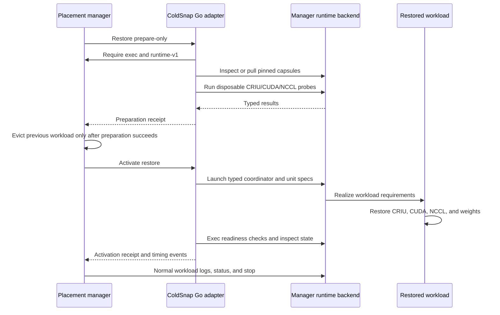

<!--
SPDX-FileCopyrightText: 2026 Scitrera LLC
SPDX-FileCopyrightText: 2026 Fox Engine Ltd
SPDX-License-Identifier: AGPL-3.0-only
-->

# Runtime-neutral manager boundary

Status: introduced in ColdSnap 0.3.20.
This is a manager-interface refactor, not a Kubernetes
operator or a claim of Kubernetes qualification. Existing Qwen/vLLM TP2
capsules have passed focused GPU restore checks on both snapshot drivers and
both weight providers. Historical qualification reports remain privately
archived; the limitations below distinguish those checks from broader support.

## Responsibility split

| Component | Owns | Does not own |
| --- | --- | --- |
| ColdSnap Go controller | Request/receipt contracts, driver selection contract, dispatch, timing stream | Scheduling, SSH, registry credentials |
| Shared Go inference adapter | Capture/restore sequence, admission, stable unit/worker topology, required workload specs, readiness, live lifecycle | Docker argv or Kubernetes calls |
| Go capsule builder | Driver-specific capsule contents, model-payload exclusion, license inputs, immutable OCI identities | Executing a particular container engine/build CLI |
| Manager host provider | Authorized node operations, typed runtime dispatch, credentials, operation lifetime | Engine-specific CUDA/NCCL restore logic |
| Reference Docker runtime backend | Docker CLI translation, credentialed registry operations, image building, workload execution/inspection/copy/logs/removal | Snapshot format or driver semantics |
| In-image Python/native code | CRIU, CUDA, NCCL, weight hydration, engine integration | Manager transport or container engine |

ColdSnap now sends `hostops.RuntimeRequest` rather than Docker commands for
capture and restore units, the coordination service, disposable compatibility
probes, cache ownership helpers, logs, state inspection, exec, file copying,
capsule construction, and publication. Both engines and both snapshot drivers
use this boundary. `internal/hostops/runtime.go` defines it;
`internal/hostprovider` carries it over the authenticated manager socket.

A manager may implement the wire contract in any language. Its runtime backend
realizes image and workload operations and handles authenticated helpers. The
[reference plugin implementation](sparkrun-integration.md#runtime-backend-and-workload-identity)
is documented separately from this contract.

ColdSnap emits neutral `io.sparksq.coldsnap.*` identity labels. A manager may
add its own labels from authorized workload metadata. Workload names are
logical manager keys; returned IDs may be opaque handles. Managers must resolve
logical names across separate operations, not only inside one provider session.

## Protocol and failure semantics

The format-1 host-provider envelope adds `operation: runtime` with a nested
`runtime` request. Adapters require `runtime-v1` before any host mutation.
`coldsnap capabilities` advertises `manager-runtime-v1`. Older providers are
rejected; the engine adapter has no internal Docker fallback. Upgrade the
provider to implement `runtime-v1` before adopting controller 0.3.20.

| Action | Important fields / result |
| --- | --- |
| `image-inspect` | `image` → OCI image-config digest `id`, `repo_digests`, byte `size` |
| `image-pull`, `image-push` | `image`; additionally require `oci-pull` / `oci-push` authority |
| `image-tag`, `image-remove` | Exact `source` + `target`, or `image`; never global pruning |
| `image-build` | `build`: base64 `dockerfile`, node `context`, named `contexts`, build `arguments`, `tag`, `pull` |
| `workload-run` | `workload` specification → detached opaque `value`, or synchronous base64 `output` |
| `workload-inspect` | Logical `name` → `id`, `image`, `state`, `exit_code`, `running`, `paused`, `labels` |
| `workload-exec` | Logical `name`, `execution` (`command`, base64 `input`, optional `user`, `combined`) → output |
| `workload-logs` | Logical `name`, optional nonnegative `tail` → combined output |
| `workload-copy-from` | Logical `name`, absolute in-workload `path`, absolute node-local `destination` |
| `workload-remove` | Stop/remove exact logical `name`; already absent succeeds |

See `internal/hostops/runtime.go` for the exhaustive schema.
The provider must reject unknown fields, wrong types, malformed base64, invalid paths,
and unsupported requirements before execution. Binary fields use standard
base64; argv remains an array, with no implicit shell evaluation. Detached
launch requires a name and prohibits stdin/combined diagnostic output so the
returned handle is unambiguous. Image entrypoint semantics are preserved unless
an explicit `entrypoint` is supplied.

Workload specs carry selected GPU device IDs, additional devices (including
`/dev/infiniband`), host-network requirements, privileges, seccomp policy,
memlock, shared memory size, UID/GID, env, labels, and read-only/read-write host
mounts. A backend must implement these requirements or reject the operation;
it must never silently drop them. `running`/`paused` and `state: exited` refer
to the serving process/container, not merely an enclosing scheduler object's
phase. Images must resolve exactly the requested reference. `image.id` is the
OCI config SHA-256 used by local-only capsules, not a runtime-specific handle;
published `repo_digests` identify registry manifests. A different backend must
preserve that distinction to use existing artifacts unchanged.

Failures use `ok: false`, human-readable `error`, and optional `error_code`:
`not_found` for a missing image/workload, `path_not_found` for a missing file in
an existing workload, and `runtime_failed` otherwise. Only `path_not_found`
can skip an optional cache directory. Permission failures or missing workloads
are not optional cache misses. Registry errors and workload-removal errors
other than absence propagate.

This is a trusted-manager interface, not a sandbox for untrusted clients.
Node exec and privileged workloads remain powerful. Host/session authorization,
credential handling, cancellation, and backend policy are manager responsibilities.

## Restore sequence

## What stays the same; what still needs work

Request, artifact, receipt, timing, capsule, native-payload, and driver ABI
formats are unchanged. No weight-loading or CUDA-graph algorithms changed.
Existing Qwen/vLLM TP2 capsules passed hardware restore qualification on n580
and n610 with native and recovery weights, subject to normal admission. New restored
workloads receive the neutral labels; previously running workloads are not
relabeled automatically when upgrading. Restore the workload with the new
manager/controller pair before using its live lifecycle operations.

Docker remains the only implemented production runtime backend. Its
[reference manager implementation](sparkrun-integration.md) does not constrain
an independent Kubernetes manager. The core capsule builder still specifies
a Dockerfile/BuildKit-compatible build frontend: the manager may delegate this
to a build service rather than a node Docker daemon. A test-only argv renderer preserves
older regression assertions and is not linked into controller/adapter binaries.

A Kubernetes implementation still needs:

1. Placement, namespace-scoped logical workload identity, GPU assignment,
   compatible privileged security policy, and RDMA device admission.
2. A node filesystem/exec service for CRIU images, activation overlays,
   coordinator endpoint files, model caches, and native payloads. Pod exec alone
   does not replace all current node operations.
3. OCI distribution and a build backend (capture/publication only), with
   registry credentials isolated from engine processes.
4. Stable serving-container status, logs, exec/copy, endpoint exposure, and
   lifecycle identity across provider sessions and operator restarts.
5. Cancellation/cleanup, failed prepare without eviction, operation retries,
   and qualification of actual CRIU/CUDA restore under the selected CRI/runtime.

The focused GPU qualification reused existing Qwen/vLLM TP2 capsules on both
drivers and weight providers. n610 recovery startup timing remains a follow-up;
successful restore is not evidence of unchanged performance. Broader release
qualification still needs capture, materialization, sleep/wake, and SGLang/DS4F.
Do not treat
contract/unit tests as performance evidence.

## Verification scope

The root-module Go tests cover the shared engine/driver workload specifications
and the controller's runtime boundary. Provider implementations also need
authority, malformed-request, image/workload, and cancellation tests against
their actual backend. The [reference plugin verification](sparkrun-integration.md#verification)
records the Docker and GPU scenarios exercised by that implementation.
