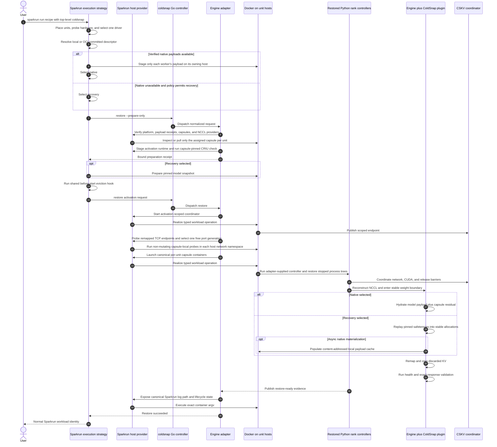

<!--
SPDX-FileCopyrightText: 2026 Scitrera LLC
SPDX-FileCopyrightText: 2026 Fox Engine Ltd
SPDX-License-Identifier: AGPL-3.0-only
-->

# Sparkrun plugin internals

## Ownership and configuration

The first-party Sparkrun plugin is the normal user interface. Its authoritative
sources live under `src/sparkrun/plugins/coldsnap/` in the separate
[sparkrun-coldsnap-plugin repository](https://github.com/sparksq/sparkrun-coldsnap-plugin).
Sparkrun distributions vendor a pinned plugin snapshot, recorded by
`vendor/coldsnap.lock` and packaged `VENDORED.toml` metadata. It owns:

- the top-level `coldsnap:` recipe item and its typed validation;
- `sparkrun coldsnap capture|publish-native|publish|materialize|restore|warm|sleep|wake|status|native-status|delete`;
- selection of the ColdSnap execution strategy for ordinary `sparkrun run`;
- cluster placement, topology construction, hardware probing, and selection of
  the newest snapshot driver supported by every placed host;
- the ColdSnap image builder on top of an exact digest-pinned engine image;
- shared image preparation and distribution;
- per-worker native-payload staging only onto the worker's owning host, full
  first-use verification, cached validation evidence, and safe full-hash
  revalidation when that evidence becomes stale;
- pinned Hugging Face snapshot preparation only when recovery is selected;
- identity-derived descriptor storage, atomic generation promotion, and
  retention of the configured last N generations;
- prepare-before-evict ordering through the reusable execution-strategy hooks;
- canonical Sparkrun container names, labels, log paths, status, and stop
  behavior after restore;
- registry and Hugging Face credential ownership; and
- the operation-scoped host-provider server.

The provider uses Sparkrun's `HostSession` abstraction. That session may use
SSH today, but this is a Sparkrun transport choice rather than an SSH call made
by the ColdSnap adapter. The same provider protocol can sit over a Kubernetes
node API, `exec`, a DaemonSet, or another manager transport.

Sparkrun intentionally omits most policy defaults from a recipe. It sends only
typed overrides and lets the selected ColdSnap driver resolve its own defaults.
It does, however, own communication variables, offline-mode variables, and
placement-specific values because those come from the live cluster plan.

Remote storage policy is cluster-local rather than recipe identity. A cluster
may set `sparkrun_cache_dir`; ColdSnap inherits its `coldsnap` child unless
`plugins.coldsnap.state_root` overrides it. `plugins.coldsnap.io.recovery_read`
can override filesystem-aware recovery `auto` for a qualified site. The
existing cluster `cache_dir` remains the Hugging Face/model cache and is not
overloaded for either purpose.

## Restore through `sparkrun run`

The prepare-only boundary is deliberately before normal Sparkrun replacement.
A missing capsule, incompatible host, invalid payload, or unavailable recovery
snapshot must fail while the existing workload is still intact.

## Runtime backend and workload identity

The standalone plugin implements `DockerManagerRuntime` and injects it through
`ColdSnapHostProvider.runtime_factory`. An alternate manager can implement the
wire contract directly in any language. The Python plugin is the reference
implementation, not a ColdSnap dependency. Its Hugging Face helpers also use
the runtime backend; credentials travel on stdin, not in workload metadata.

ColdSnap emits neutral `io.sparksq.coldsnap.*` identity labels. Sparkrun adds
its own `sparkrun.*` labels from the authorized operation's workload metadata,
preserving normal Sparkrun status/log/stop integration. Workload names are
logical manager keys; returned IDs may be opaque handles. Managers must resolve
logical names across separate operations, not only inside one provider session.

## Controller acquisition

Sparkrun resolves the four executables as one indivisible tool set. It first
tries the GitHub release archives and their `checksums.txt`, then the matching
Docker Hub binary-bundle image, and finally a source-pinned Docker build. Every
path records and rechecks the extracted binary hashes and verifies
`coldsnap version --json` before use. A private GitHub repository is supported
through `GH_TOKEN`, `GITHUB_TOKEN`, or an existing `gh auth login` session.
Public bundle pulls require no registry credentials. The controller's
[distribution guide](distribution.md) describes release publication.

## Credentials and host storage

With Sparkrun's host provider, registry login is required only on the
controller. Sparkrun uses its selected cluster transport and controller-side
Docker client, so Docker forwards controller-held registry authorization when
pushing capsules and pulling them into restore hosts. No credentials are
installed on unit hosts. Direct development must supply an equivalent
manager-provider implementation.

Credentials stay with the manager. Sparkrun removes Hugging Face tokens from
the ColdSnap child environment and sends them only as stdin to the short-lived
helper process performing the authenticated operation. Docker credentials are
likewise supplied by the controller-side Docker client; they are not installed
on cluster nodes.

ColdSnap routes supported compiler and JIT caches below the canonical
`/var/cache/coldsnap/runtime` root. This includes the vLLM, Torch, Triton,
FlashInfer, CuteDSL, and CUDA driver caches; the CUDA driver cache is enabled
and bounded to 1 GiB. These are adapter-owned launch settings, so callers
should not set those cache environment variables themselves. Sparkrun capture
may attach a per-unit copy of its resolved runtime-cache leaf at this root.
Capture warmup updates that copy and the finished tree is baked into the OCI
capsule. Restore uses the capsule copy and does not require a host runtime-cache
mount.

ColdSnap rank controllers run as root inside their privileged containers so
they can drive CRIU and CUDA checkpoint operations. They do not retain root
ownership on the host: capture roots, staged runtime caches, derived-cache
copies, failure reports, and materialized native packs are normalized back to
the manager's UID/GID before the operation returns. Sparkrun also mounts the
prepared Hugging Face snapshot and local model inputs read-only. If a manager
implements the host-provider protocol directly, the account serving that
provider is the ownership identity used for these managed paths.

## Target-local residual overlays

Sparkrun compares the resulting artifact with the portable descriptor. The
model-payload objects must have the same owner, role, size, and SHA-256; they
remain shared and are never copied into the overlay. If the capsule and replay
objects are also identical, the temporary capture is discarded. Otherwise,
Sparkrun stores a local overlay descriptor bound to the portable descriptor,
snapshot driver, rank-ordered manager host identities, accelerator inventory,
and exact installed NVIDIA driver versions. Ordinary restore selects it only on
the same matching target that owns the local capsule images. Missing, stale, or
invalid overlay metadata falls back to the portable artifact.

This is an acceleration cache, not a new portable publication. Its target-local
capsules and residual maps can change after a driver/runtime update and are
removed with the recipe's local ColdSnap artifacts.

## Local deletion

`sparkrun coldsnap delete` scopes local cleanup to the rendered recipe and snapshot driver. Reachability-aware deletion of shared published native objects remains future manager/distribution work.

## Verification

- Full root-module Go tests and shared engine/driver workload-spec tests.
- Full standalone plugin tests, including malformed requests and authority checks.
- Go → authenticated Unix socket → Python manager → real local Docker:
  inspect, launch, exec with binary stdin, logs, typed missing-path error, cleanup.
- Real local image build, inspect, workload file copy, and exact test-resource cleanup.
- Real Qwen/vLLM TP2 n580/n610 native/recovery restore, exact streamed response,
  normal Sparkrun logs/status/stop, and cache-cleared Docker-to-first-token measurements.

The local smoke tests use a cached BusyBox image, no GPUs, no registry pushes,
and generated test-only names. Enable them through `COLDSNAP_SOURCE_ROOT`,
`COLDSNAP_GO`, and `COLDSNAP_TEST_DOCKER_IMAGE`; otherwise they skip explicitly.
The GPU qualification stopped only its own measured test workloads and left
pre-existing coordinator-only containers untouched.
